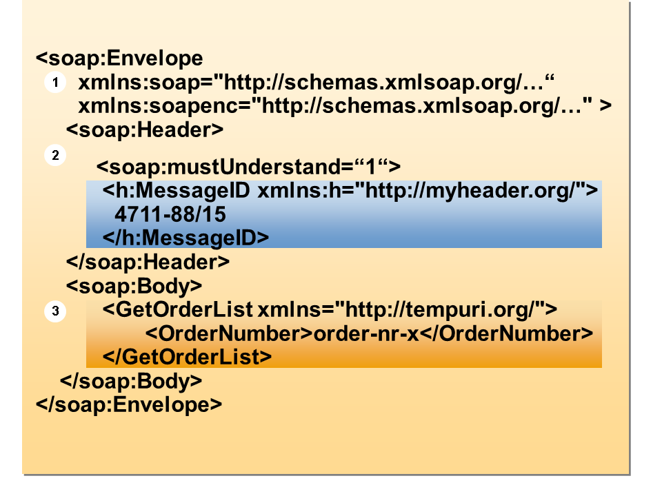

## Client Server Communication

---

---
## Agenda
+ SOAP
+ REST
+ gRPC
+ Websockets
+ SSE
+ graphQL
+ Webhooks
---
## SOAP
+ Simple Object Access Protocol
+ Von Microsoft 
+ erschien im Jahr 1999
+ Standard von W3C
+ arbeitet unabhängig von den auf den Systemen verwendeten Technologien
+ statefull und stateless!
+ Nur XML

---
## SOAP

---
## REST
+ Representational State Transfer
+ stateless
+ HTML, XML, Plain Text oder JSON
+ 
---
## REST
### Bedingungen für RESTful:
  + Client-Sever Architektur
  + Stateless Kommunikation
  + Cachingfähige Daten
  + einheitliche Schnittstelle zwischen Komponenten
  + Mehrschichtsystem: Client/Server-Interaktionen auf hierarchische Schichten
  + Code-on-Demand: Server schickt Code

## REST vs SOAP 

---
## Quellen

+ https://www.redhat.com/de/topics/integration/whats-the-difference-between-soap-rest

+ https://help.sap.com/saphelp_SCM700_ehp02/helpdata/en/48/64cf5c9f0c055ee10000000a42189b/content.htm?no_cache=true