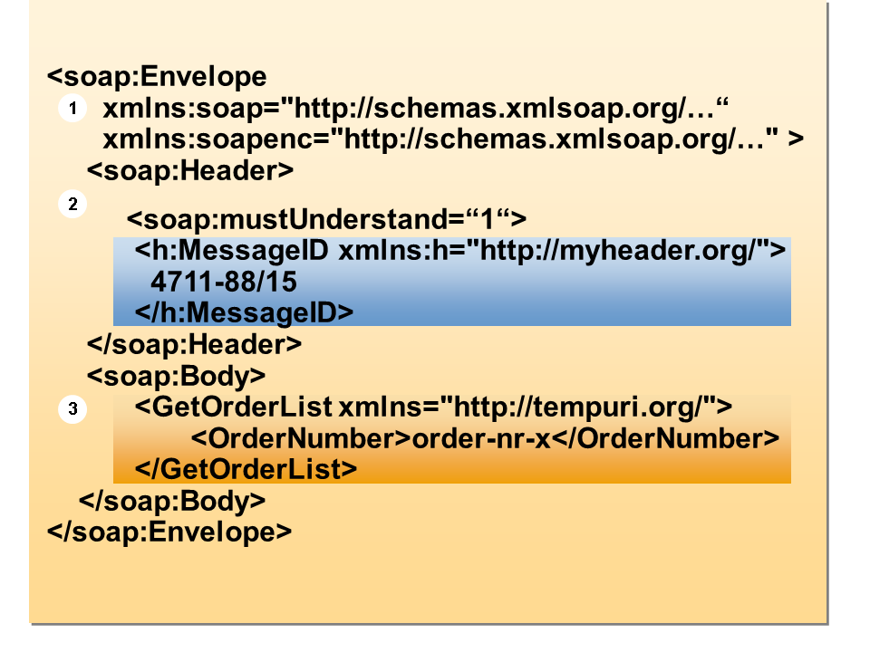
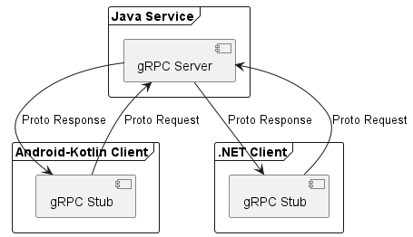
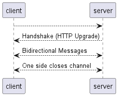
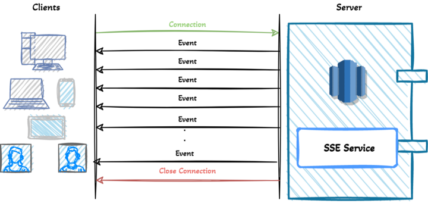
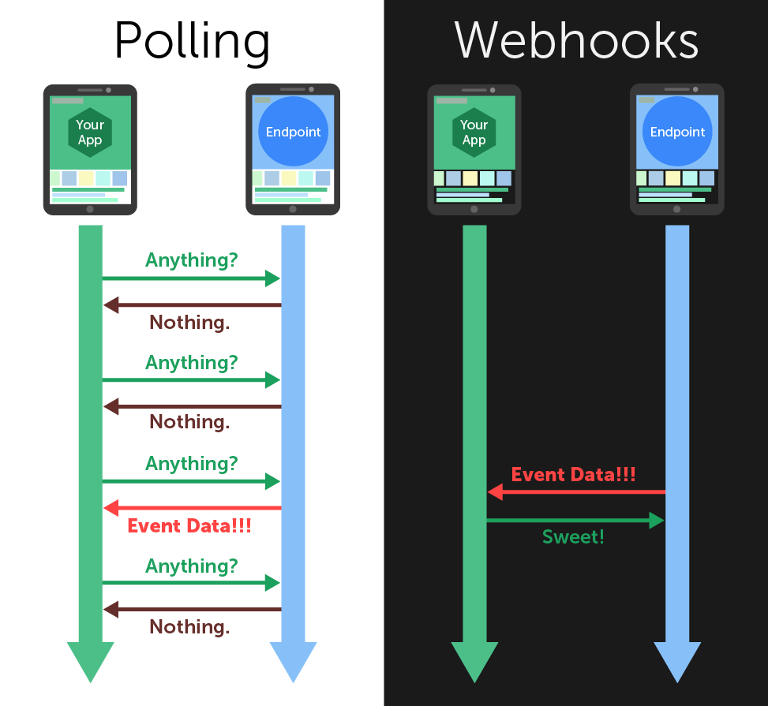

## Client Server Communication

---

---
## Agenda
+ SOAP
+ REST
+ gRPC
+ Websockets
+ SSE
+ graphQL
+ Webhooks
---
## SOAP
+ Simple Object Access Protocol
+ Von Microsoft 
+ erschien im Jahr 1999
+ Standard von W3C
+ arbeitet unabhängig von den auf den Systemen verwendeten Technologien
+ statefull und stateless!
+ Nur XML!

---
## SOAP

---
## REST
+ Representational State Transfer
+ Stateless
+ Entwickelt von Roy Fielding
+ HTML, XML, Plain Text oder JSON
+ Cachingfähige Daten
+ einheitliche Schnittstelle zwischen Komponenten
+ Mehrschichtsystem: Client/Server-Interaktionen auf hierarchische Schichten
---
## REST vs SOAP 
+ SOAP für alte Systeme
+ REST schnellere Alternative
+ Compliance für SOAP aufwändig zu erstellen
---
## gRPC
+ Von Google
+ Remote-Procedure-Call-System
+ Open Source
+ sehr effizent
+ Transparenzprinzip: kein Unterschied von einer lokalen Kommunikation zu weit entfernteren Instanzen
+ Benutzt: HTTP und .proto - [Protocol Buffers](https://grpc.io/docs/what-is-grpc/introduction/)
---
## gRPC Overview

---
## Websockets
+ statefull
+ 2008 von IETF
+ TCP 
---
## Websockets
 

---
## SSE
+ Server-sent events
+ real-time Applikationen
+ HTTP
+ [leicht zu implementieren](https://github.com/G-khan/server-sent-events)
---
## SSE 

---
## GraphQL

+ Abfragesprache und serverseitige Runtime für APIs
+ macht APIs schneller, flexibler und entwicklerfreundlicher
+ [Abfrage Beispiel](https://graphql.org/learn/)
---
## GraphQL
+ Vorteile: 
  + Stark definierte Datentypen verringern das Risiko einer Fehlkommunikation zwischen Client und Server.
  + „Single Source of Truth" - unabhängig zusammenzuschließen von APIs
+ Nachteile:
  +  Funktionalität von Datenabfragen zur Serverseite -> höhere Komplexität
  +  Caching komplexer 
---
## Webhooks
+ nicht-standardisierter Kommunikationsprozess
+  Webserver miteinander reden lassen, die dies aufgrund unterschiedlicher Sprachen eigentlich nicht können
+ Pipes, Plugins und Websides, ...
+ technisch nur eine URL
+ URL wird Befehl zugewiesen
+ meist in JSON
---
## Webhooks

---

# Thank you for your attention!

---
## Quellen

+ https://www.redhat.com/de/topics/integration/whats-the-difference-between-soap-rest

+ https://help.sap.com/saphelp_SCM700_ehp02/helpdata/en/48/64cf5c9f0c055ee10000000a42189b/content.htm?no_cache=true

+ https://grpc.io/docs/what-is-grpc/introduction/

+ https://medium.com/yemeksepeti-teknoloji/what-is-server-sent-events-sse-and-how-to-implement-it-904938bffd73

---

+ https://www.redhat.com/de/topics/api/what-is-graphql

+ https://www.mailjet.com/de/blog/email/webhooks/